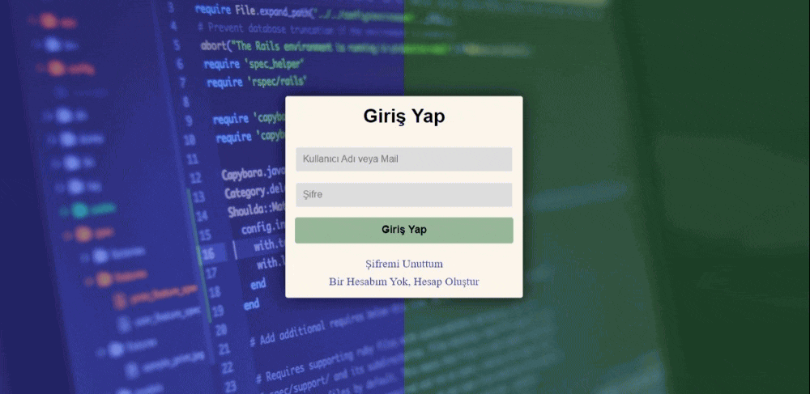

<h1>UC_Login_Register_Project</h1> 

<h2> Kullanılan Teknolojiler</h2>

HTML ve CSS ile kayıt ol, kullanıcı girişi ve şifre yenile bölümleri ayrı ayrı oluşturuldu. 
Bölümler arası geçişler ve sayfanın her yenilenmesinde, ekranın sol üst köşesinden ekranın ortasına kayarak gelme animasyonu kullanıldı.

<h2> Ekran Görüntüsü</h2>

